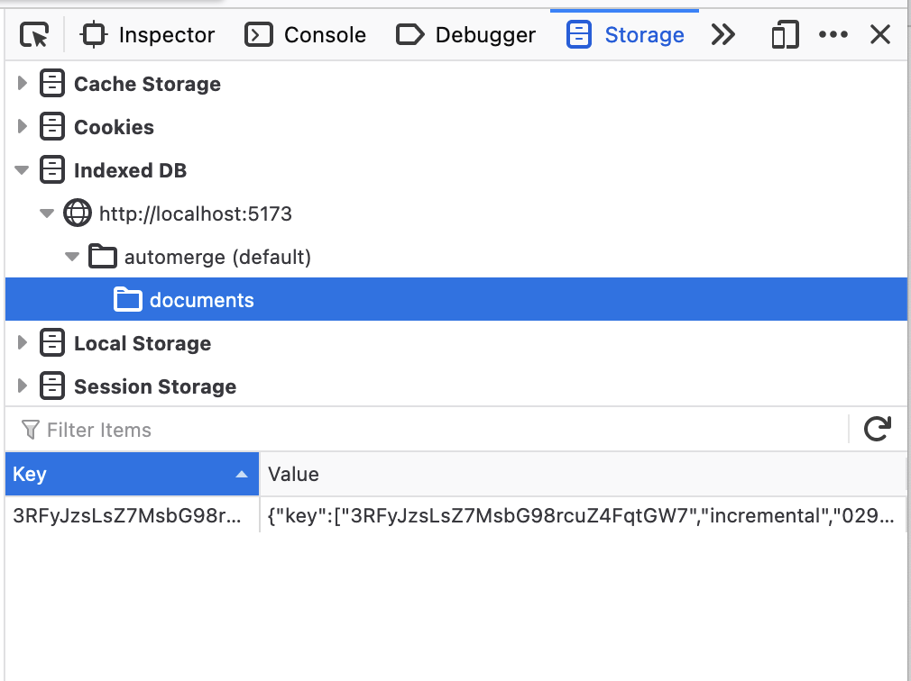
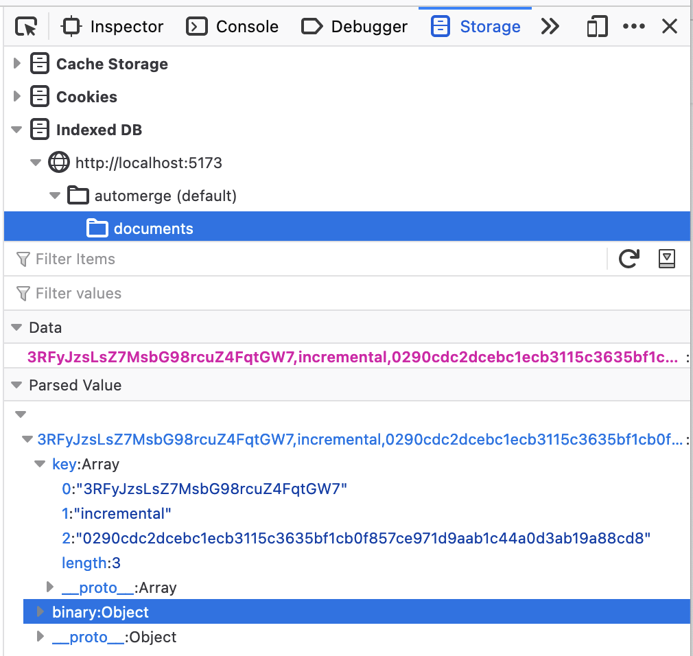
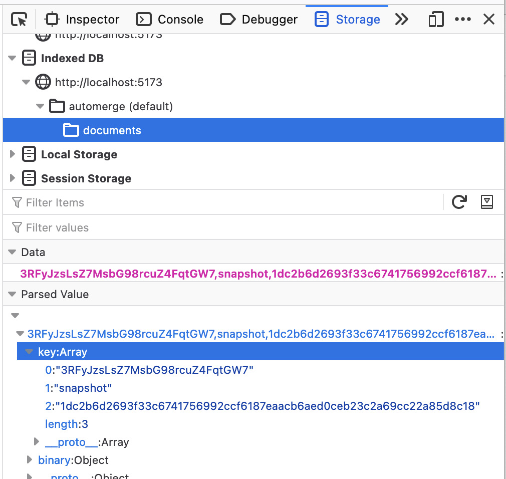
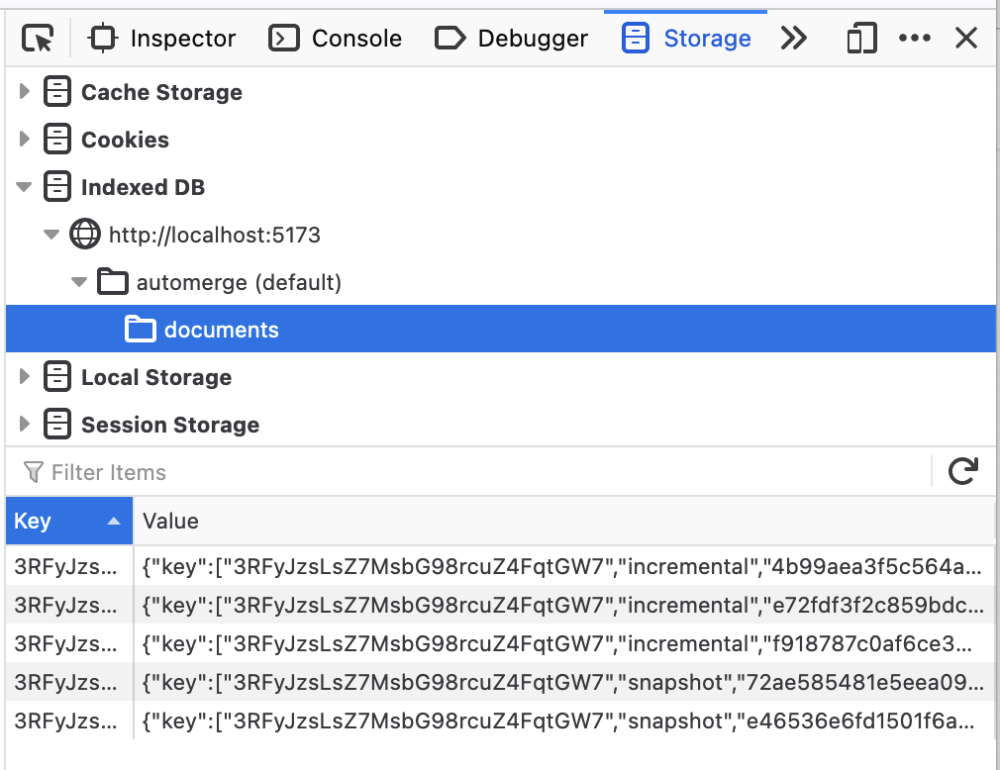

In the [tutorial](/docs/tutorial) section we introduced a simple task list which synchronizes a todo list between any number of tabs. If you close all the tabs and open a new one you will see that the value of the todo list is persisted. How is this working? What's going on?

Before we dive into that, try this experiment. Modify the definition of the `repo` in `main.tsx` to look like this:

```typescript
const repo = new Repo({
  network: [], // This part means that we're not sending live changes anywhere
  storage: new IndexedDBStorageAdapter(),
});
```

Now if you open two tabs with the same URL you'll notice that the task list is not updated live between tabs. However, if you modify the todo list in both tabs and then refresh either tab the todo list will include the edits from the other tab.

Clearly there is more going on here than just saving the current state of the document somewhere.

## Under the hood

Both tabs initialize a `Repo` pointing at an IndexedDB storage adapter, because the tabs are on the same domain this means they have access to the same storage.

Let's mess around with this in the browser. First, clear your local IndexedDB for the `localhost` domain, then open `http://localhost:5173` (without a hash component). The browser will update to contain a hash component with the document ID in it. In this example the URL in the browser window is `http://localhost:5173/#automerge:3RFyJzsLsZ7MsbG98rcuZ4FqtGW7`, so the document URL is `automerge:3RFyJzsLsZ7MsbG98rcuZ4FqtGW7`.

Open the browser tools and take a look at IndexedDB you'll see a database called `automerge` and within that an object store called `automerge`. For me, in Firefox, this looks like:



You can see that there is a key which looks roughly like our document URL (it doesn't have the `automerge:` prefix) and some kind of value. If we expand that we see:



If you're not familiar with IndexedDB this might be a little confusing. IndexedDB is a sort of key/value store where the keys are arrays. So what we are seeing here is a binary array (the `binary: Object` part in the above screenshot) stored under the key `["3RFyJzsLsZ7MsbG98rcuZ4FqtGW7", "incremental", "0290cdc2dcebc1ecb3115c3635bf1cb0f857ce971d9aab1c44a0d3ab19a88cd8"]`.

Okay, so creating a document (which is what happens when we load the page) stores a binary array under some key in the object database. This binary array is a single "incremental" change. An incremental change is not the entire history of the document but just some set of changes to the document. In this case it's the change that initializes the document with a `"counter"` field.

Now, make some change to the task list and take another look at IndexedDb.



Well, there's still one entry, but it's changed. The `[.., "incremental", ..]` key has been deleted and replaced with `[.., "snapshot", ..]`. What's happened here? Every time you make a change automerge-repo saves that change to your storage adapters. Occasionally automerge-repo will decide that it's time to "compact" the document, it will take every change that has been written to storage so far (in this case, every key beginning with `[<document URL>, .., ..]` and combine them into a single snapshot and then save it as this `[.., "snapshot", ..]` key.

All well and good in one tab. Open a new tab with the same URL (including the hash) and click the count button a few times in both tabs. If you look at the IndexedDB browser tools (in either tab, it's shared between them) you'll something like this:



You can see here that there are two snapshot files. This is because when each tab compacts incremental changes and then deletes the original incremental files, it only deletes the incremental changes it had previously loaded. This is what makes it safe to use concurrently, because it only deletes data which is incorporated into the compacted document. But the real magic comes with how this is loaded. If you load another tab with the same URL it will sum the counts from both the previous tabs. This works because when the repo starts up it loads all the changes it can find in storage and merges them which it can do because automerge is a CRDT.

## The storage model

The objective of the storage engine in automerge-repo is to be easy to implement over a wide range of backing stores (e.g. an S3 bucket, or a postgres database, or a local directory) and support compaction without requiring any concurrency control on the part of the implementor. Compaction is crucial to make the approach of storing every change that is made to a document feasible.

The simplest model of storage is a key/value model. We could attempt to build storage on top of such a model by using the document ID as a key, appending new changes for a document to that key and occasionally compacting the document and rewriting the value at that key entirely. The problem with this is that it makes it complicated to use the storage engine from multiple processes. Imagine multiple processes are making changes to a document and writing them to the storage backend. If both of these processes decide to compact at the same time then the storage engine would need to have some kind of transaction to ensure that between the time a compacting process read from storage and then wrote to it no other process added new changes to storage. This is not hard for something like a postgres database, but it's very fiddly for simple mediums like a directory on the local filesystem.

What we want to be able to do then is to know that if we are writing a compacted document to storage we will never overwrite data which contains changes we did not compact. Conveniently the set of changes in the document is uniquely identified by the heads of the document. This means that if we use the tuple `(document ID, <heads of document>)` as the key to the storage we know that even if we overwrite data another process has written it must contain the same changes as the data we are writing.

Of course, we also want to remove the un-compacted data. A compacting process can't just delete everything because another process might have written new changes since it started compaction. Each process then needs to keep track of every change it has loaded from storage and then when compacting _only delete those changes_.

The upshot of all this then is that our model for storage is not a key value store with document IDs as keys and byte arrays as values, but instead a slightly more complex model where the keys are arrays of the form `[<document ID>, <chunk type>, <chunk identifier>]` where chunk type is either `"snapshot"` or "`incremental"` and the chunk ID is either the heads of the documnt at compaction time or the hash of the change bytes respectively. The storage backend then must implement range queries so the storage system can do things like "load all the chunks for document ID x".

In typescript that looks like this:

```typescript
export type StorageKey = string[];

export abstract class StorageAdapter {
  abstract load(key: StorageKey): Promise<Uint8Array | undefined>;
  abstract save(key: StorageKey, data: Uint8Array): Promise<void>;
  abstract remove(key: StorageKey): Promise<void>;
  abstract loadRange(
    keyPrefix: StorageKey,
  ): Promise<{ key: StorageKey; data: Uint8Array }[]>;
  abstract removeRange(keyPrefix: StorageKey): Promise<void>;
}
```
